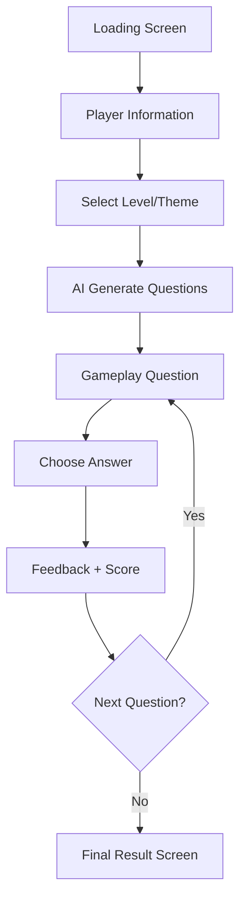

# Bé Ứng Biến — Full Project Concept
**Team: TungTungSahur**
**Project Context:** A web game using AI to help children practice real-life safety scenarios through interactive gameplay and instant feedback.

> "Một web game tương tác dùng AI để giúp trẻ học cách xử lý các tình huống thực tế thông qua gameplay, phản hồi trực tiếp và hệ thống tính điểm."

---

## 1. Project Overview

### Ý tưởng chính
Đây là một web game giáo dục (interactive AI game / scenario-based learning platform) dành cho trẻ em.

**Luồng người chơi chính:**
* Nhập tên + tuổi.
* Chọn chủ đề màn chơi.
* AI sinh tình huống ngẫu nhiên.
* Chọn cách xử lý.
* Nhận feedback & tính điểm.

## 2. Core Goal

Mục tiêu **KHÔNG** phải chỉ là làm quiz đơn thuần, mà là giúp trẻ **luyện phản xạ xử lý tình huống an toàn** ngoài đời thực.

## 3. Main Features

### AI-Generated Situations
AI tự sinh tình huống, đáp án và giải thích dựa theo độ tuổi của người chơi.

### Game-like Experience
Giao diện được thiết kế như một mini game / interactive story để tăng tính hấp dẫn.

### Instant Feedback
Giải thích đúng/sai, phân tích hậu quả và hướng dẫn cách xử lý đúng ngay sau mỗi lựa chọn.

### Score System
Hệ thống tính điểm và hiển thị kết quả cuối game tạo cảm giác tiến bộ (progression).

## 4. Target Users & Content

| Độ tuổi | Nội dung trọng tâm |
| :--- | :--- |
| **4–6** | Người lạ, đồ vật nguy hiểm |
| **7–9** | Đi lạc, an toàn tại trường học |
| **10–12** | An toàn Internet (Internet Safety) |
| **13–15** | Lừa đảo online, cyberbullying |

## 5. Full User Flow

---

## 6. Screen Breakdown

### SCREEN 1: Loading Screen
*   **Mục đích:** Branding, preload assets, tạo cảm giác bắt đầu một trò chơi.
*   **Thành phần:** Logo, mascot animation, loading bar, nút Start.

### SCREEN 2: Player Information
*   **Inputs:** Tên (Personalize) và Tuổi (AI adjusts difficulty).
*   **Logic:** Tuổi ảnh hưởng đến độ khó, cách dùng từ và chủ đề AI khởi tạo.

### SCREEN 3: Select Level
Dùng để chọn chủ đề, điều hướng AI prompt và tạo cảm giác chinh phục.

| Level | Theme | Ví dụ tình huống |
| :--- | :--- | :--- |
| **Lv1** | 🏠 Home Safety | Người lạ gõ cửa, ổ điện, dao kéo |
| **Lv2** | 🏫 School Safety | Bắt nạt, người lạ đón hộ, an toàn sân trường |
| **Lv3** | 🚦 Street Safety | Qua đường, đi lạc, đi theo người lạ |
| **Lv4** | 🌐 Internet Safety | Link lạ, chia sẻ thông tin cá nhân, scam |
| **Lv5** | 🚨 Emergency | Cháy nổ, gọi cứu hộ, tai nạn |

**UI Style:** Dạng thẻ (Card-based selection) với hiệu ứng hover, âm thanh và chuyển cảnh mượt mà.

### SCREEN 4: Gameplay Question
Đây là phần quan trọng nhất của ứng dụng.

*   **Situation Card:** Mô tả tình huống (VD: "Một người lạ muốn chở em về nhà. Em sẽ làm gì?").
*   **4 Answer Choices:** Các lựa chọn đa dạng (Safe, Risky, Dangerous) để tăng tính thực tế.

### SCREEN 5: Feedback Screen
Dạy cách tư duy và củng cố kiến thức.

*   **Đúng:** ✅ Chính xác! Giải thích tại sao đúng và hướng dẫn thêm.
*   **Sai:** ⚠️ Cảnh báo nguy hiểm. Giải thích hậu quả tiềm ẩn.
*   **Yêu cầu:** Feedback cần ngắn gọn, dễ hiểu, không gây sợ hãi cho trẻ.

### SCREEN 6: Final Result
*   Hiển thị tổng điểm (Safety Score).
*   Tóm tắt hiệu suất và lời khen ngợi/khuyến khích.
*   Gợi ý các chủ đề cần cải thiện.
